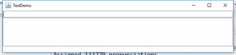

# DoubleTrochee
A completely unnecessary utility to make every text input a Talking Heads song.

Entry point: [AddFillersLive.java](src/main/java/double_trochee/AddFillersLive.java), which spawns a rudimentary text-entry prompt that copies words off the input and interjects with *qu'est-ce que c'est* as it deems appropriate. There's also a phonologist/developer console on the bottom showing the current stress pattern at play. The trigger for interjection is primary/secondary, then no stress, then primary/secondary again, then no stress again. Think of the stress pattern for the phrase 'psycho killer', and voila.

This utility uses [CMU's pronunciation dictionary](http://www.speech.cs.cmu.edu/cgi-bin/cmudict) and is only word-based (i.e. no multiword re-stressing for auxiliaries and prepositions and such). The license is copied off [this repo](https://github.com/cmusphinx/cmudict).

Some day I dream of making this into an Android keyboard (qu'est-ce que c'est). If anybody out there knows their way around those grounds and is willing to help me, may the gods of '70s rock be ever in your favor. Also, drop me a note.
